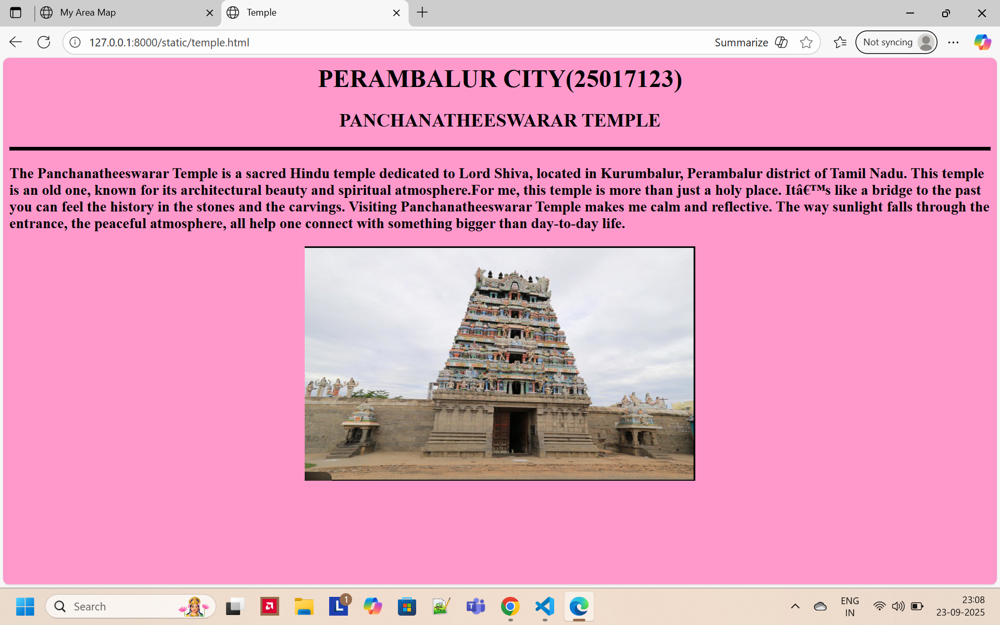

# Ex04 Places Around Me
## Date: 20-09-2025

## AIM
To develop a website to display details about the places around my house.

## DESIGN STEPS

### STEP 1
Create a Django admin interface.

### STEP 2
Download your city map from Google.

### STEP 3
Using ```<map>``` tag name the map.

### STEP 4
Create clickable regions in the image using ```<area>``` tag.

### STEP 5
Write HTML programs for all the regions identified.

### STEP 6
Execute the programs and publish them.

## CODE
```
map.html

<html>
<head>
    <title>My Area Map</title>
</head>
<body>
    <h1 align="center">PERAMBALUR CITY</h1>
    <h2 align="center">SIVASAKTHI S(25017123)</h2>
    
    <map name="image-map">
        <area target="" alt="Panchanatheeswarar Temple" title="Panchanatheeswarar Temple" href="temple.html" coords="4,341,76,475,273,397,194,226" shape="poly">
        <area target="" alt="Perambalur District Collector Office" title="Perambalur District Collector Office" href="office.html" coords="865,331,131" shape="circle">
        <area target="" alt="Ram Cinema Theatre" title="Ram Cinema Theatre" href="theatre.html" coords="591,8,849,103" shape="rect">
        <area target="" alt="Dhanalakshmi Srinivasan Medical College And Hospital" title="Dhanalakshmi Srinivasan Medical College And Hospital" href="medical college.html" coords="712,742,975,876" shape="rect">
        <area target="" alt="Sri Ramakrishna College Of Engineering" title="Sri Ramakrishna College Of Engineering" href="eng college.html" coords="1001,714,1273,827" shape="rect">
    </map>
</body>
</html>

eng college.html

<html>
<head>
    <title>Eng College</title>
</head>
<body  bgcolor="339999" align="center">
    <h1 align="center">PERAMBALUR CITY(25017123)</h1>
    <h2 align="center">SRI RAMAKRISHNA COLLEGE OF ENGINEERING</h2>
     <hr size="5" color="black">
 
    <h3 align="left">Sri Ramakrishna College of Engineering (SRCE) is one 
        of the prominent private engineering colleges in 
        Perambalur district, Tamil Nadu. It is run by the 
        Sri Swamy Vivekananda Educational Trust, which manages
        several schools, polytechnics, and colleges in the 
        region.The origin of the institution goes back to
        educational efforts by the Trust, which started 
        with a small Nursery and Primary School in 1984. 
        Over the years, the institution expanded and added 
        higher educational institutions, eventually establishing 
        the engineering college.</h3>
            
</body>
</html>

medical college.html

<html>
<head>
    <title>Eng College</title>
</head>
<body  bgcolor="339999" align="center">
    <h1 align="center">PERAMBALUR CITY(25017123)</h1>
    <h2 align="center">SRI RAMAKRISHNA COLLEGE OF ENGINEERING</h2>
     <hr size="5" color="black">
 
    <h3 align="left">Sri Ramakrishna College of Engineering (SRCE) is one 
        of the prominent private engineering colleges in 
        Perambalur district, Tamil Nadu. It is run by the 
        Sri Swamy Vivekananda Educational Trust, which manages
        several schools, polytechnics, and colleges in the 
        region.The origin of the institution goes back to
        educational efforts by the Trust, which started 
        with a small Nursery and Primary School in 1984. 
        Over the years, the institution expanded and added 
        higher educational institutions, eventually establishing 
        the engineering college.</h3>
            
</body>
</html>

office.html

<html>
<head>
    <title>Eng College</title>
</head>
<body  bgcolor="339999" align="center">
    <h1 align="center">PERAMBALUR CITY(25017123)</h1>
    <h2 align="center">SRI RAMAKRISHNA COLLEGE OF ENGINEERING</h2>
     <hr size="5" color="black">
 
    <h3 align="left">Sri Ramakrishna College of Engineering (SRCE) is one 
        of the prominent private engineering colleges in 
        Perambalur district, Tamil Nadu. It is run by the 
        Sri Swamy Vivekananda Educational Trust, which manages
        several schools, polytechnics, and colleges in the 
        region.The origin of the institution goes back to
        educational efforts by the Trust, which started 
        with a small Nursery and Primary School in 1984. 
        Over the years, the institution expanded and added 
        higher educational institutions, eventually establishing 
        the engineering college.</h3>
            
</body>
</html>

temple.html

<html>
<head>
    <title>Temple</title>
</head>
<body bgcolor="FF99CC" align="center">
    <h1 align="center">PERAMBALUR CITY(25017123)</h1>
    <h2 align="center">PANCHANATHEESWARAR TEMPLE</h2>
     <hr size="5" color="black">
   
  
    <h3 align="left">The Panchanatheeswarar Temple is a sacred Hindu temple 
        dedicated to Lord Shiva, located in Kurumbalur, 
        Perambalur district of Tamil Nadu. This temple is an 
        old one, known for its architectural beauty and 
        spiritual atmosphere.For me, this temple is more 
        than just a holy place. It’s like a bridge to the
        past you can feel the history in the stones and 
        the carvings. Visiting Panchanatheeswarar Temple 
        makes me calm and reflective. The way sunlight falls
        through the entrance, the peaceful atmosphere, all
        help one connect with something bigger than 
        day-to-day life.</h3>
          
   
</body>
</html>

theatre.html

<html>
<head>
    <title>Theatre</title>
</head>
<body bgcolor="CCCCFF" align="center">
    <h1 align="center">PERAMBALUR CITY(25017123)</h1>
    <h2 align="center">RAM CINEMA THEATRE</h2>
    <hr size="5" color="black">

    <h3 align="left">Ram Theatre is a popular cinema theatre located in many 
       towns across Tamil Nadu.It is well known for screening 
       the latest Tamil, Telugu, Hindi, and sometimes English 
       movies.For many people in the local area, Ram Theatre 
       is not just a place to watch films but also a spot for 
       social gathering and entertainment.Ram Theatre is one of 
       the oldest and most recognized theatres in its area.
       It gives people an affordable way to enjoy movies with 
       family and friends.During festival releases (like Pongal 
       or Diwali), the theatre atmosphere is very energetic, 
       with cut-outs, posters, and celebrations by fans.
       It also supports the local economy by providing 
       jobs and business opportunities around the theatre 
       (food stalls, auto drivers, small shops).</h3>
        
</body>
</html>


```

## OUTPUT





## RESULT
The program for implementing image maps using HTML is executed successfully.
